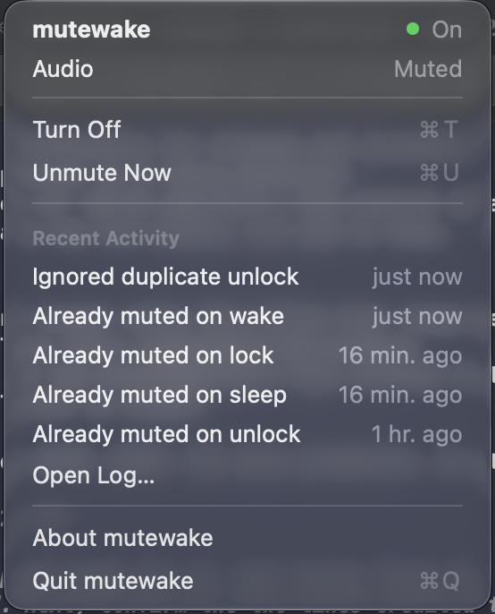

# mutewake

Mutes your Mac's audio output every time it sleeps, locks, wakes, or unlocks.

## Why

If you need speakers on for calls, it's easy to forget to mute before walking
into a lecture, a library, or a meeting — and then your laptop rings, or plays a
notification sound, in a quiet room.

Scheduling a mute doesn't really solve it: schedules change, classes get
cancelled, and a fixed timer will happily mute you in the middle of a call.
mutewake inverts the failure mode instead. Audio is muted whenever you close the
lid or wake the machine, and you unmute deliberately when you actually need
sound. The worst case becomes "a meeting starts silent for five seconds" rather
than "my phone rings during a lecture."

Muting at sleep matters as much as at wake: it means an incoming call can't ring
a laptop that's asleep in your bag.

## Install

Requires macOS 13+ and the Xcode Command Line Tools (`xcode-select --install`).

```sh
git clone https://github.com/00mkp/mutewake.git
cd mutewake
./install.sh
```

Or from a [release](https://github.com/00mkp/mutewake/releases) archive:

```sh
curl -sL https://github.com/00mkp/mutewake/archive/refs/tags/v0.3.1.tar.gz | tar -xz
cd mutewake-0.3.1
./install.sh
```

Cloning is worth preferring: `install.sh` records where it ran from, so a clone
gives you working `mutewake update` afterwards. Installing from an archive records
the extracted directory instead, so later updates need an explicit path.

The installer builds **mutewake.app** from source into `~/Applications`, generates
a launchd agent for your account, and starts it. It builds locally rather than
shipping a binary so you never hit Gatekeeper quarantine — and so you can read
exactly what you're running. Set `APP_DIR` to install the app somewhere else, e.g.
`APP_DIR=/Applications ./install.sh`.

## Usage

```
mutewake on           turn the feature on (starts the daemon if needed)
mutewake off          turn it off (survives reboot; the menu bar icon stays)
mutewake toggle       flip between on and off
mutewake status       feature state, daemon state, current audio, recent events
mutewake status -n N  same, showing the last N log entries (default 5)
mutewake update       pull the latest source, rebuild, reinstall
mutewake update PATH  update from a directory or .tar.gz/.tgz/.zip instead
mutewake uninstall    remove the daemon, agent, state, and logs
```

```
$ mutewake status
version:  0.3.1
feature:  on
daemon:   running (pid 13958)
audio:    muted
recent:
  [2026-09-03 15:32:01] sleep: muted
  [2026-09-03 15:32:05] wake: already muted (muted while away)
```

To get sound back, tap the volume-up key. mutewake **mutes** rather than setting
the volume to zero, so your level is preserved.

## Menu bar

The daemon also puts an icon in the menu bar — a sleeping speaker, dimmed while
the feature is off. Clicking it shows:



- whether mutewake is on, and whether audio is currently muted
- **Turn On / Turn Off** (⌘T) — the same switch as `mutewake on|off`
- **Mute Now** (⌘M) / **Unmute Now** (⌘U) — unmuting restores your previous level
- **Recent Activity** — the last five events, e.g. "Muted on sleep · 2 min ago"
- **Open Log…**, **About**, and **Quit** (⌘Q)

The menu and the CLI share one on/off switch, so they never disagree: turn it off
in a terminal and the icon dims immediately. **Quit** stops the daemon entirely
until your next login or `mutewake on`; while quit, nothing is muted. Opening
mutewake from Spotlight, Launchpad, or Finder brings it back too — and if it's
already running, opening it shows the menu.

## How it works

A small Swift agent subscribes to four events and sleeps in between — it polls
nothing and uses no measurable CPU:

| Event | Behavior |
| --- | --- |
| `willSleep` (lid close) | Mutes silently; nobody is looking at the screen |
| `screenIsLocked` | Same as sleep |
| `didWake` (lid open) | Mutes, and shows a banner |
| `screenIsUnlocked` | Same as wake |

Leaving (sleep, lock) mutes silently; returning (wake, unlock) shows the banner.
Locking earns its own trigger because a Mac can sit locked but awake — lid open,
on power — and nothing would mute it until you came back, leaving a window where
notifications play aloud.

Wake and unlock usually fire together on a lid-open, so events within five
seconds of each other are collapsed to avoid a duplicate banner. If the machine
was muted on the way out, the next return reports it — otherwise muting on leave
would leave nothing for the banner to say.

`mutewake off` only writes a state file. The daemon keeps running — the menu bar
icon has to stay so you can turn the feature back on from it — and checks the file
on every event, doing nothing while it exists. Because the flag lives on disk,
"off" survives a reboot: at login the daemon starts, sees it, and sits idle with a
dimmed icon. It watches the config directory with a kernel file event (no
polling), which is how a toggle from the terminal reaches the menu.

Quit from the menu exits cleanly, and the agent is configured with
`KeepAlive: { SuccessfulExit: false }`, so launchd won't respawn it until the next
login, `mutewake on`, or you open the app.

launchd always owns the running copy. Opening the app by hand would otherwise
start a second, unmanaged instance, so a hand-opened copy instead asks launchd to
start the real one (a no-op if it's already up), tells it to show its menu, and
exits. It tells the two apart by `XPC_SERVICE_NAME`, which launchd sets to the
agent's label.

Everything it touches:

```
~/.local/bin/mutewake                          the CLI
~/Applications/mutewake.app                    the app (menu bar + daemon)
~/.local/share/mutewake/manifest               version, source, and app path
~/Library/LaunchAgents/io.github.00mkp.mutewake.plist
~/.config/mutewake/disabled                    present only when off
~/Library/Logs/mutewake.log                    trimmed to 500 lines at startup
```

## Updating

```sh
mutewake update
```

`install.sh` records where it was run from, so `update` can find your checkout,
`git pull --ff-only` it, rebuild, and reinstall — then confirm the daemon is
running at the new version before reporting success. `--ff-only` is deliberate:
a plain pull would silently create a merge commit in your checkout if upstream
history were ever rewritten.

Updating (or rerunning `install.sh`) keeps mutewake on or off as you left it; only
a first install switches it on.

If you installed from a tarball rather than a clone, point it at a source tree:

```sh
mutewake update ~/Downloads/mutewake-0.3.1.tar.gz
mutewake update ~/some/checkout
```

Archives are extracted to a temporary directory, checked to make sure they
actually contain a mutewake source tree, and installed from there. Your recorded
source is preserved across an archive update, so a one-off archive install
doesn't break `mutewake update` afterwards.

There's no upgrade-only check — `update` installs whatever tree you give it, so
pointing it at an older archive is a valid way to roll back.

If the recorded checkout has been moved or deleted, `update` stops and tells you
how to re-clone rather than fetching from a hardcoded URL. A fork's installed
copy should never silently start pulling from somebody else's repository.

## Versioning

Semver in the `VERSION` file at the repo root. `install.sh` reads it, stamps it
into the app bundle and the install manifest at
`~/.local/share/mutewake/manifest`, and `mutewake status` reports it.

## Known limitation: banner attribution

The "Audio muted" banner is attributed to **Script Editor**, not to mutewake.

This isn't an oversight. macOS refuses to register an ad-hoc-signed,
non-notarized app with the notification center — `UNUserNotificationCenter`
returns `Notifications are not allowed for this application` and never shows a
permission prompt. Moving the bundle to `~/Applications`, launching it through
LaunchServices, `lsregister`, adding the full complement of `Info.plist` keys,
and embedding the plist in the binary all make no difference. Posting through
`osascript` works reliably, so that's what it does. Fixing the attribution
properly requires a paid Apple Developer ID.

## Testing

```sh
./test/verify.sh
```

Integration tests against the real launchd agent and real audio state: muting on
lock and unlock, debounce, the no-op path, `off` leaving the daemon idle, `off`
surviving a simulated reboot and a reinstall, toggle round-trips, quit and
restart, the app's install location, opening it handing off to launchd, and
argument rejection. It toggles your actual audio while running, opens the menu
once, and leaves the feature on.

The sleep path isn't covered — `NSWorkspace` rejects externally posted
notifications, so `willSleep` can only be exercised by genuinely sleeping the
machine.

## Uninstall

```sh
mutewake uninstall
```

Removes the agent, the app, state, logs, and the command itself. Your source
checkout is left alone.

## License

MIT — see [LICENSE](LICENSE).
